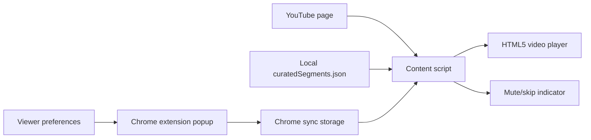
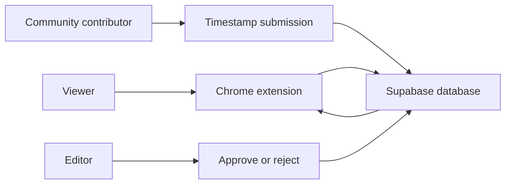

# Architecture

## MVP

## Future Backend

## Main Pieces

- `manifest.json`: Chrome extension configuration
- `popup.html`, `popup.css`, `popup.js`: settings and timestamp suggestion UI
- `content.js`: player detection, matching, mute/skip actions, and overlay
- `data/curatedSegments.json`: local editor-approved demo data
- `supabase/schema.sql`: future backend schema for videos, segments, submissions, and reviews

## Data Flow

1. The popup stores rating, category, site, and pause settings.
2. The content script detects the current video URL.
3. The script loads approved segments for that URL.
4. If the current playback time enters a matching segment, it mutes or skips.
5. Suggestions are saved locally now and can later be sent to Supabase for editor review.
